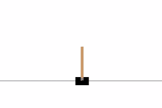

# deep-q-learning

Introduction to Making a Simple Game AI with Deep Reinforcement Learning

Minimal and Simple Deep Q Learning Implemenation in Keras and Gym. Under 100 lines of code!

The explanation for the `dqn.py` code is covered in the blog article
[https://keon.kim/writing/deep-q-learning/](https://keon.kim/writing/deep-q-learning/)

I made minor tweaks to this repository such as `load` and `save` functions for convenience.

I also made the `memory` a deque instead of just a list.
This is in order to limit the maximum number of elements in the memory.

The training might be unstable for `dqn.py`. This problem is mitigated in `ddqn.py`.
I'll cover `ddqn` in the next article.

## Changelog

### 2026-05
- Migrated from `gym` to `gymnasium` and updated for the modern reset/step API.
- Updated for Keras 3 (`Adam(learning_rate=)`, `Input` layer, `keras.losses.Huber`).
- `ddqn.py` now implements actual Double DQN (online net selects, target net evaluates).
- Removed CartPole-specific reward shaping from `ddqn.py` so it's env-agnostic.
- `save()` / `load()` now persist `epsilon` alongside the weights.
